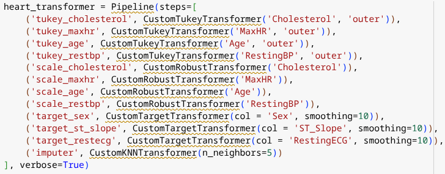

# Heart Disease Data Pipeline Documentation

## Pipeline Overview
This pipeline preprocesses the Heart Disease dataset to prepare it for machine learning modeling. It includes categorical mapping, target encoding, outlier detection and treatment, robust scaling, and missing value imputation.

## Step-by-Step Design Choices

### 1. Sex Mapping (`map_sex`)
- **Transformer:** `CustomMappingTransformer('Sex', {'M': 0, 'F': 1})`
- **Design Choice:** Binary encoding of sex with female as 1 and male as 0
- **Rationale:** Simple and space-efficient encoding for binary gender variable

### 2. Outlier Treatment for Age (`tukey_age`)
- **Transformer:** `CustomTukeyTransformer(target_column='Age', fence='outer')`
- **Design Choice:** Tukey outer fence to remove extreme outliers
- **Rationale:** Helps ensure robust scaling is not distorted by highly atypical ages

### 3. Outlier Treatment for Cholesterol (`tukey_chol`)
- **Transformer:** `CustomTukeyTransformer(target_column='Cholesterol', fence='outer')`
- **Design Choice:** Tukey outer fence
- **Rationale:** Cholesterol can vary widely; extreme values are capped for consistency

### 4. Outlier Treatment for MaxHR (`tukey_maxhr`)
- **Transformer:** `CustomTukeyTransformer(target_column='MaxHR', fence='outer')`
- **Design Choice:** Tukey outer fence
- **Rationale:** Extreme MaxHR values may indicate measurement errors or rare conditions

### 5. Outlier Treatment for Oldpeak (`tukey_oldpeak`)
- **Transformer:** `CustomTukeyTransformer(target_column='Oldpeak', fence='outer')`
- **Design Choice:** Tukey outer fence
- **Rationale:** Helps normalize depression data before scaling

### 6. Outlier Treatment for RestingBP (`tukey_restbp`)
- **Transformer:** `CustomTukeyTransformer(target_column='RestingBP', fence='outer')`
- **Design Choice:** Tukey outer fence
- **Rationale:** Controls for extremely low or high resting BP measurements

### 7. Age Scaling (`scale_age`)
- **Transformer:** `CustomRobustTransformer(target_column='Age')`
- **Design Choice:** RobustScaler
- **Rationale:** Age distribution may not be normal; robust to outliers

### 8. Cholesterol Scaling (`scale_chol`)
- **Transformer:** `CustomRobustTransformer(target_column='Cholesterol')`
- **Design Choice:** RobustScaler
- **Rationale:** Cholesterol often contains outliers and is right-skewed

### 9. MaxHR Scaling (`scale_maxhr`)
- **Transformer:** `CustomRobustTransformer(target_column='MaxHR')`
- **Design Choice:** RobustScaler
- **Rationale:** Ensures MaxHR is on a comparable scale without being skewed by extremes

### 10. Oldpeak Scaling (`scale_oldpeak`)
- **Transformer:** `CustomRobustTransformer(target_column='Oldpeak')`
- **Design Choice:** RobustScaler
- **Rationale:** Maintains distribution consistency for this numeric feature

### 11. RestingBP Scaling (`scale_restbp`)
- **Transformer:** `CustomRobustTransformer(target_column='RestingBP')`
- **Design Choice:** RobustScaler
- **Rationale:** Avoids standard scaler issues caused by outliers

### 12. Imputation (`impute`)
- **Transformer:** `CustomKNNTransformer(n_neighbors=4)`
- **Design Choice:** KNN Imputer with k=4
- **Rationale:** Uses similarity between data points to estimate missing values more accurately

## Pipeline Execution Order Rationale
1. Categorical mapping is applied early so other numeric steps can follow
2. Outlier removal is done before scaling to ensure extreme values don’t distort scale
3. Scaling is applied before KNN imputation to ensure distances are comparable
4. Imputation is performed last to fill any missing values using preprocessed features

## Random State

The value used in train_test_split is: 

rs = 33