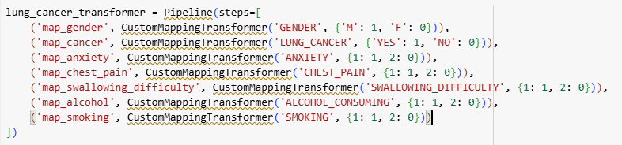
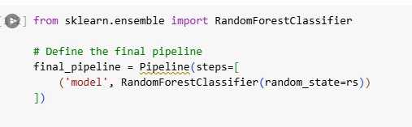

# Final Production Pipeline

This pipeline is used for lung cancer prediction based on selected features from the reduced dataset.

## Screenshot

## Description
- Input features were pre-processed and selected using LightGBM feature importance.
- Final dataset includes the following features:  
  `AGE`, `ANXIETY`, `CHEST_PAIN`, `SWALLOWING_DIFFICULTY`, `ALCOHOL_CONSUMING`, `GENDER`, `SMOKING`.

## Note
The pipeline uses a RandomForestClassifier with a fixed `random_state=192`.